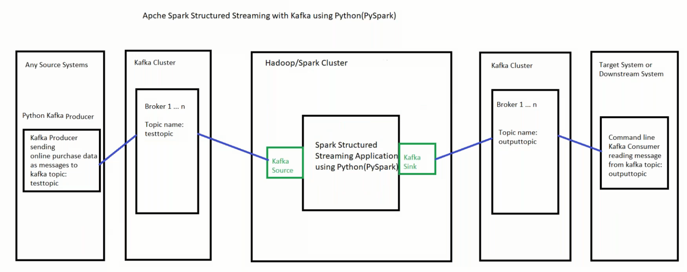

# Kafka Spark Streaming Project



## Setup
Using CMDER setup 4 kafka terminals

1. To start the zookeper use the following command:  
```zookeeper-server-start.bat config\zookeeper.properties```
2. To start the Kafka server use the following command:  
```kafka-server-start.bat config\server.properties```
3. Topic creation window -  
To create the kafka topic (testtopic) for the producer to publish messages:  
```kafka-topics.bat --bootstrap-server localhost:9092 --topic testtopic --create --partitions 3 --replication-factor 1 ```  
To create the kafka topic (outputtopic) for the producer to publish messages:  
```kafka-topics.bat --bootstrap-server localhost:9092 --topic outputtopic --create partitions 3 --replication-factor 1```
4. Stream verification window:-   
To check if the published message are being recived by the topic:   
```kafka-console-consumer.bat --bootstrap-server localhost:9092 --topic outputtopic --from-beginning```  
To check if the published message are being recived by the topic:  
```kafka-console-consumer.bat --bootstrap-server localhost:9092 --topic testtopic --from-beginning```


## Execution
- First setup and run the kafka terminals.  
- Then setup and run the python producer.  
- Then setup and run the spark consumer. 
- Then check if the consumer is writing to another kafka topic successfully.

